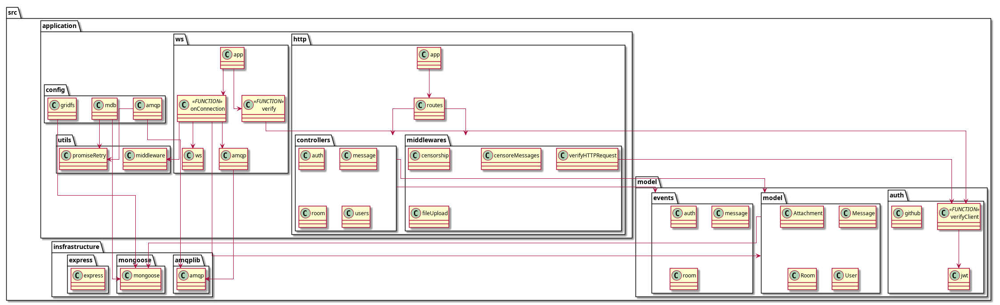
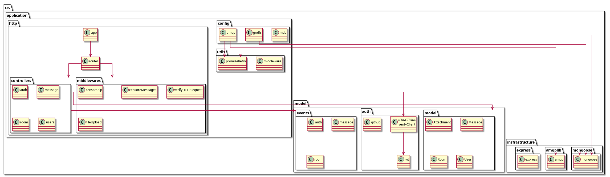
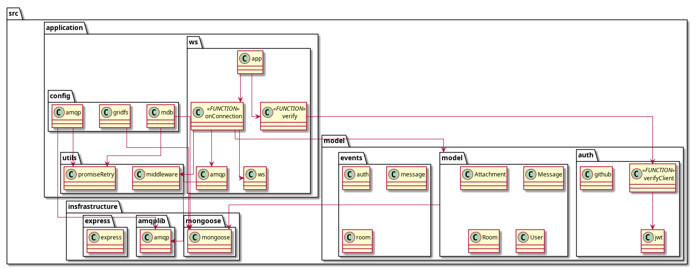
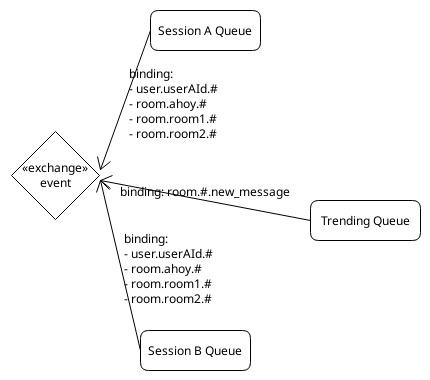

# Documentation

## Links

[Ahoy App Site](https://ahoy-app.herokuapp.com/)

[Ahoy Trands Site](https://ahoy-trends.herokuapp.com/metrics?token=)

[Open API Link](https://editor.swagger.io/?url=https://raw.githubusercontent.com/ahoy-app/documentation/master/openapi.yaml)

## Views

### Components and Connector

**.CnC API Server**

**.CnC Trending Server**

### Packages

**.Packages**

**.Packages Layered**

**.Packages Layered HTTP**

**.Packages Layered WS**

### Deploy

**.Deploy**

## Flow

**.Sign Up**

**.Connect WS**

**.Send Message**

**.Kick User**

## Messages

**.EIP Topic Subscribe**

