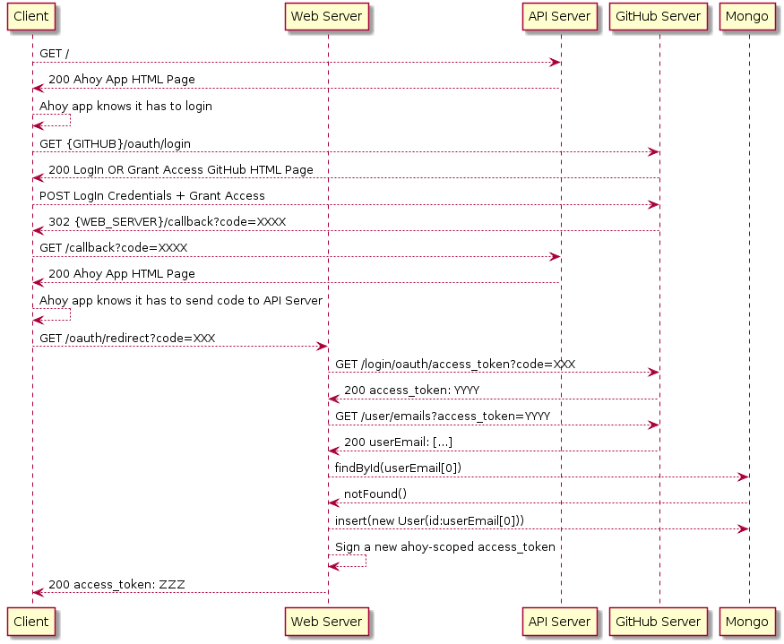

# Diseño del sistema

Debido a las características solicitadas por el Dueño de Producto, podemos asumir que los principales requerimientos del sistema son:

- Una aplicación web cliente fácil de usar y compatible con los principales navegadores modernos.
- Una servidor que ofrezca una API que permita la cliente realizar operaciones síncronas en el sistema.
- Un servidor que ofrezca una API que permita al cliente recibir eventos relevantes para mantener su estado sincronizado con el del backend.

Ademas de estos requisitos básicos, podemos inferir que también necesitaremos:

- Un sistema de persistencia que descarge al servidor de la responsabilidad de mantener estado.
- Un sistema de mensajería que solucione el paso de eventos entre el servidor REST síncrono y el servidor WS de eventos
- Un sistema de almacenamiento de objetos para la subida y descarga de ficheros
- Un sistema de autenticación que no requiera verificación contra el sistema de persistencia ni afinidad de sesión

## Decisiones de diseño

Son muchas las opciones que un desarrollador web full-stack puede tomar a la hora de implementar un servicio web. El abanico de herramientas puede abrumar en un principio y a menudo las decisiones se basan en lo ya conocido o en sesgos propios. Para este proyecto, se ha tratado de tensar el equilibrio entre aprender nuevas herramientas y aprovechar los conocimientos previos sobre otras.

### Node + Express vs Python + Flask vs Java + Spring

Empezando por el framework para el lado del servidor, se barajaron inicialmente tres opciones: Node, Python y Java.

Los puntos a favor de Python eran su aparentemente fácil desarrollo de código y su ecosistema Flask+Tornado que parecía ofrecer buenos resultados combinando HTTP y Web Sockets. No obstante, la experiencia manejando Python no era alta y se decidió desecharlo como opción en pos de un menor esfuerzo de aprendizaje.

El primer prototipo funcional se implementó en Java + Spring Boot con el módulo Spring Messaging. Si bien abstraía los detalles de implementación enormemente, no ofrecía el control de bajo nivel que se buscaba en la implementación para aplicar los patrones EIP que se desearan. Se encontraron otras aproximaciones dentro del ecosistema Spring como el manejo de Web Sockets a bajo nivel con el handleTextMessage, pero resultaban contra-intuitivas en la filosofía de Spring ya que obligaban a gestionar el estado de la conexión manualmente al combinarse con RabbitMQ. Además, era complicado encontrar documentación ya que el uso de Web Sockets en Spring parece estar _de facto_ vinculado al uso de STOMP, cosa que no se buscaba en este proyecto.

Finalmente, se optó por Node por varios motivos. El primero de ellos era buen equilibrio que ofrecía entre control de bajo nivel y sencillez de programación al explotar la naturaleza funcional y asíncrona de Javascript. De ese modo, se podía declarar fácilmente una estructura de callbacks que orquestaran correctamente los eventos de Rabbit y del Web Socket sin preocuparse por mantener manualmente una lista de sesiones activas o similar. El otro motivo fue las mejoras en rendimiento que parecía ofrecer en varios _benchmarks_ Node contra Java, especialmente en la gestión de bloqueos y concurrencia.

### REST vs GraphQL

Si bien GraphQL era una de esas tecnologías que se buscaba aprender, los propios requerimientos del Product Owner y el tiempo disponible para realizar el proyecto impidieron su inclusión. No obstante, se valora que habría sido especialmente interesante de cara a la implementación de la aplicación web ya que habría permitido desacoplarla de la API REST y delegar en ella el formato de consumo de los datos así como las optimizaciones y la carga especulativa. Por ello la solución escogida finalmente fue una API REST tradicional.

### WebSocket vs Server Side Events

En un punto intermedio del proyecto, se tomó la decisión indirecta de que los mensajes serían enviados del cliente al servidor vía API REST y no aprovechando la bidireccionalidad del canal Web Socket. El motivo de esta decisión no fue otro que la sencillez en la implementación, ya que esto permitía, por un lado, reutilizar todo el código similar del resto de controladores REST y por otro, delegar el canal de Web Socket a un canal unidireccional de eventos sin acciones persistentes.

Esta decisión abrió entonces la puerta a reemplazar la tecnología Web Socket por SSE. Los dos principales motivos para no hacerlo fueron, por un lado, la falta de soporte de algunos navegadores modernos, y por otro, el tiempo y esfuerzos extra que supondría adoptar una tecnología nueva, incluyendo readaptar el sistema actual de autentificación.

### JSON Web Token vs Session Cookie

Existen varias formas de autentificar a un usuario en un servicio web. Si bien las session cookies son ampliamente utilizadas, se buscaba una solución que permitiera eliminar la afinidad en el balanceo sin delegar la persistencia de la cookie en una base de datos. Por ello se decidió adoptar JWT como sistema, ya que delega la persistencia de la sesión en el cliente de un modo seguro. Este sistema ofrece, sin embargo, una desventaja: la dificultad de revocación de una sesión, problema que quedaba completamente fuera del alcance de este proyecto, por lo que no supuso un argumento de peso para no adoptar JWT.

### Mongo vs SQL

Actualmente es difícil encontrar un servicio web que no nazca sobre Mongo DB. Sus promesas de escalado y distribución son sólidas y existen numerosas herramientas que facilitan su uso hasta un punto caso trivial en la mayoría de casos cubiertos. Sin ánimo de caer en una moda irracional, y asumiendo que, en la mayoría de los casos, una base de datos relacional habría sido la opción correcta, se optó finalmente por Mongo debido a las herramientas mencionadas. Una solución más madura en un marco profesional podría ser una combinación de SQL para el modelo de Usuarios y Salas y una base de datos de baja latencia como Redis para los Mensajes.

### GridFS vs Minio

En una de las sesiones teóricas se introdujo Minio como almacén de objetos distribuido. A pesar de sus bondades, la experiencia con él y concretamente, la experiencia desplegándolo, hicieron que se abandonara desde un principio la idea de su uso. Ofrece un pobre soporte para las cuentas de usuario, lo que impide su exposición directa por motivos de seguridad. Sabiendo esto, y asumiendo que será necesario entonces implementar un intermediario que autentifique al usuario y retransmita el fichero, se decidió aprovechar la base de datos ya desplegada, Mongo, y su soporte para ficheros de gran tamaño GridFS.

### React vs Vanilla

La elección tecnológica para el lado del cliente sufría una fuerte restricción: Cualquiera que fuera la herramienta escogida, tenía que permitir un control preciso del estado de la aplicación en todo momento; permitir su actualización de dicho estado tanto por acción del usuario como por eventos provenientes del servidor; y ofrecer una vista sincronizada con el estado en todo momento.

La complejidad de implementar algo así manualmente en vanilla era casi tan alta como la probabilidad de introducir serios errores de concurrencia y glitches visuales. Por ello se decidió utilizar un framework ya conocido: React. React, en conjunción con Redux, ofrecen un flujo de datos unidireccional y actualizaciones de estado secuenciales y deterministas así como vistas siempre sincronizadas con dicho estado.

## Escenarios de comportamiento

Los escenarios modelados a continuación representan las secuencias más representativos que se dan lugar en la aplicación.

### Sign Up

La secuencia de registro incluye, además, a la secuencia de login ya que, por diseño, se ha decidido que ambos procesos sean indistinguibles para el usuario. Esto es: La primera vez que un usuario acceda al sistema, se le creará una cuenta de usuario vinculada a sus credenciales de terceros, para que la próxima vez que acceda, se recupere dicha sesión.

Para el acceso, es necesario poseer previamente una cuenta en GitHub. En el proceso, de solicita a la API OAuth de GitHub un código que, por un lado, autentique al usuario y por otro, permita obtener un access_token con permisos de lectura sobre la información del usuario. De este modo, el servidor podrá obtener el correo electrónico y el nickname. En el futuro, sería posible incluir también el icono de usuario y otra información relevante.

Una vez creado o recuperado el usuario de la base de datos, se firma un token JWT propio del servicio web (no confundirlo con el JWT obtenido de GitHub y firmado por GitHub) y se le envía al cliente para que lo almacene de forma segura y lo use en futuras peticiones.

### Connect to WS

La conexión con el Web Socket se hace en dos pasos definidos por el protocolo: primero un handshake hecho sobre HTTP clásico y a continuación, el establecimiento de la conexión persistente. En la primera etapa, se usa el token enviado en la petición HTTP para autentificar al usuario y en la segunda etapa se recupera la información del relevante del usuario para suscribirlo a los tópicos relevantes, como pueden ser en este caos, las salas en las que está.

### Send Message

Este escenario concreto, no sólo representa la interacción más habitual en el sistema, sino que también representa al resto de peticiones HTTP de escritura del sistema. Se suelen componer estas de tres fases: lectura de la base de datos y verificación de permisos; escritura del resultado del cambio en la base de datos; y finalmente propagación de un evento que notifique el cambio.

### Kick User

Este último escenario extiende las fases del escenario anterior con un paso extra. Al añadir o echar a un usuario de una habitación, cada cola (vinculada a una sesión Web Socket activa) debe añadir o quitar un binding al tópico de esa habitación. De ese modo, conexiones existentes pueden escuchar en salas que no podían escuchar en su inicio.

