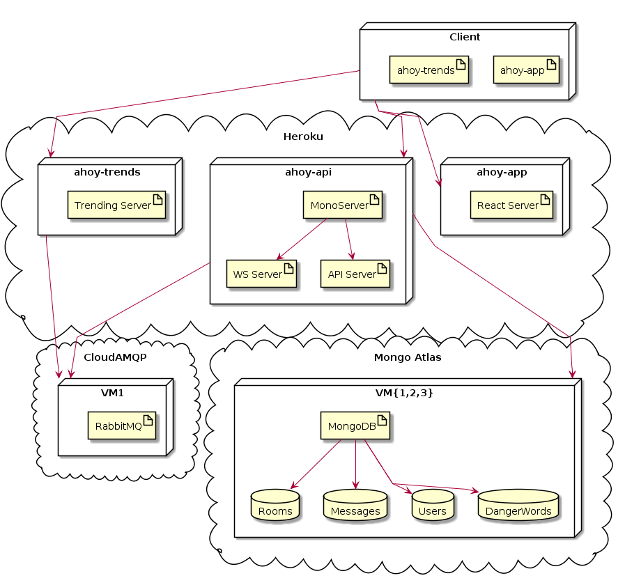
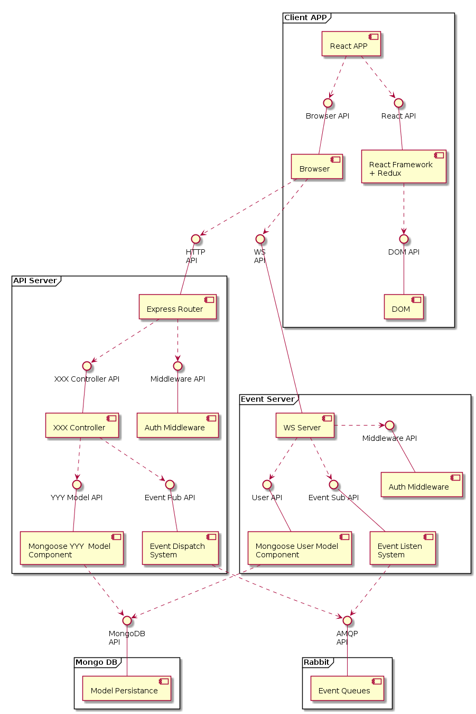
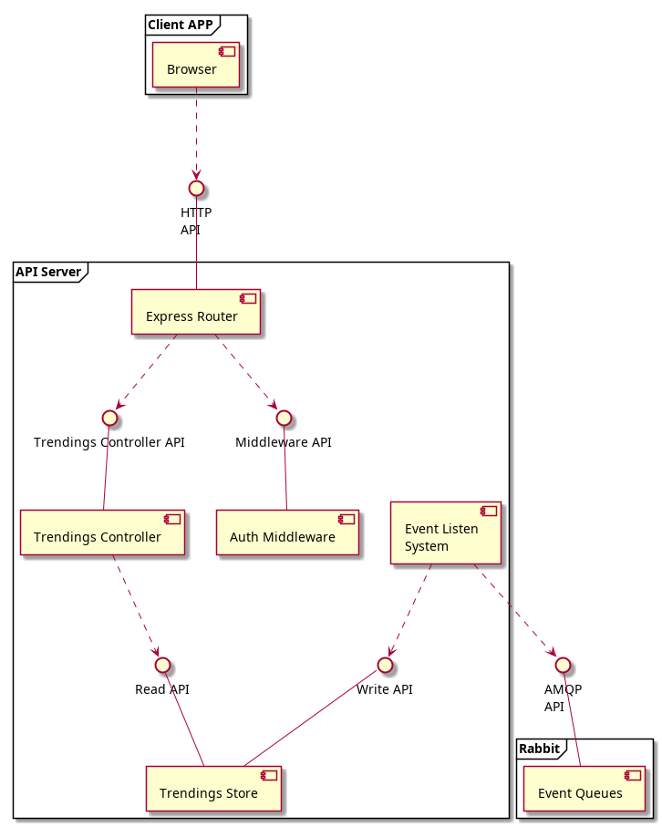
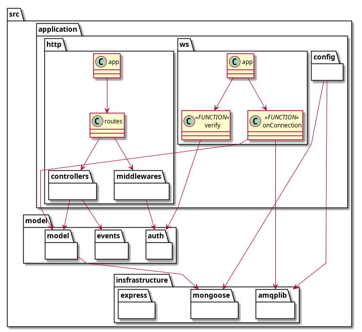

# Decisiones Arquitecturales y Patrones implementados

La arquitectura escogida para esta aplicación es la tradicional Cliente-Servidor 3-Tier. El motivo de ello es la sencillez que ofrece frente a una 4-Tier, aspecto interesante dado el poco tiempo disponible para la implementación. Si bien habría sido deseable incluir un gateway que resolviera tanto el login como el logging, quedaba fuera del alcance del proyecto, además de que implicaría resolver problemas no triviales, como el forwarding de los Web Sockets.

## Depliegue

Empezaremos por la vista de despliegue para entender cuanto antes los nodos que conforman la aplicación en su conjunto.

Los nodos de la aplicación son entonces:

- Cliente con la aplicación web
- Servidor de la aplicación web cliente
- Servidor de API
- Servidor de Trendings
- Broker de mensajes RabbitMQ
- Base de Datos MongoDB

Tanto el broker como la base de datos han sido "contratados" como servicio. Esto implica, por un lado, delegar los problemas de administración y despliegue mientras, por otro lado, incrementamos el coste o sacrificamos prestaciones. Por último, también hay que considerar los posibles problemas de latencia si los nodos de persistencia se despliegan lejos de los nodos de la aplicación.

Los nodos de aplicación, sin embargo, se despliegan en el proveedor cloud Heroku. Al igual que sucedía con los nodos de persistencia, implica una relación coste-rendimiento peor que con unos servidores autogestionados con Kubernetes pero permite acceder a un tier gratuito que cumple los requisitos mínimos del proyecto. Sin embargo, obliga a sumir varios tradeoffs respecto a Kubernetes:

- No hay soporte para HTTP2
- No hay soporte nativo para configuraciones centralizadas
- No hay soporte nativo para descubrimiento de dinámico
- No hay opción de enrutado virtual interno: todas las conexiones se hacen vía red exterior

Cabe destacar que, aunque no se hayan estacado en el diagrama, todas las conexiones entre nodos se hacen vía conexiones seguras: HTTPS y WSS entre cliente y nodos de aplicación y AMQPS y Mongo+SSL entre nodos de aplicación y nodos de persistencia.

Por último, cabe destacar que el nodo del Servidor de API está desplegando conjuntamente el servidor HTTP y el servidor Web Socket. Esto se ha decidido hacer así por simplicidad en el despliegue pero será la última vez que los veamos juntos en un diagrama ya que son dos servicios autónomos.

## Vista de Componentes y Conectores

La vista de componentes y conectores nos muestra los componentes en ejecución y sus relaciones de uso entre ellos. Veremos primero la vista del Servidor de API ya que el Servidor de Trends comparte la mayoría de decisiones arquitecturales.

### API Server

Siguiendo el diagrama de arriba a abajo, podemos ver cómo la aplicación web desarrollada en React utiliza principalmente dos APIs: la [Api del navegador no relacionada con el DOM](https://developer.mozilla.org/es/docs/Web/API) (concretamente, la [función fetch](https://developer.mozilla.org/es/docs/Web/API/Fetch_API)) y la [API de React](https://reactjs.org/docs/react-api.html).

Continuando hacia abajo, React es el encargado de usar la [API del DOM](https://developer.mozilla.org/es/docs/Web/API) que ha sido deliberadamente separada para aclarar que la aplicación en React no tiene acceso ni ha de preocuparse por el acceso al DOM (una de las grandes ventajas de React).

Como en toda aplicación web, el navegador es el encargado de comunicarse con los servidores. En este caso, mediante la [API HTTP y la API de eventos Web Socket](https://editor.swagger.io/?url=https://raw.githubusercontent.com/ahoy-app/documentation/master/openapi.yaml). Cabe especificar que la API de Eventos no ha sido detallada en Open API al no adecuarse bien al paradigma. No obstante será especificada en el apartado de Interfaces.

El Servidor de API REST, a la izquierda, muestra cómo Espress expone la API REST y coordina los dos elementos importantes, los middlewares (llamado así en el ecosistema Express) y los Controllers (similares a los controladores del patrón MVC).

Los middlewares no son sino funciones de filtrado que toman un objeto request, un objeto response y un callback pasa pasar el control al siguiente filtro. Algunos middlewares de ejemplo pueden ser el del autentificación, que verifique el JWT; el de subida de ficheros, que intercepte las peticiones multipart; o el de censura, que intercepta las respuestas salientes que contienen mensajes y enmascara las palabras peligrosas.

Los controllers encapsulan las acciones de la API REST en una relación 1:1 comunicándose con el tier de persistencia a través de las APIs de los objetos de modelo y realizando las consultas o mutaciones pertinentes así como la consecuente emisión de eventos a tarvés de la API del sistema de emisión de eventos. Un requisito extra sería la posibilidad de hacer estas acciones de forma transaccional. No obstante, no se ha abordado esa funcionalidad a lo existir una acción crítica que dependiera de esa propiedad.
CyC
El Servidor de Eventos, a la derecha, muestra cómo el servidor Web Socket de Node utiliza las APIS de tres componentes: El middleware de autentificación, que es comparte la lógica con el del Servidor de API REST a través de un adaptador, pero es un componente distinto en ejecución; el objeto del modelo que representa a los usuarios y se comunica con la capa de persistencia; y el sistema de escucha de eventos.

### API Server

Las diferencias más significativas con el diagrama anterior son la eliminación de una aplicación cliente, la eliminación del servidor de eventos externo y la eliminación de los objetos del modelo. Las adiciones son, un Store en memoria en el lugar del modelo, un controlador nuevo para leer el estado de ese modelo y un sistema de escucha de eventos conectado a RabbitMQ que modifica el Store en base a los eventos recibidos: contando las palabras de los mensajes de texto.

## Packetes

El diagrama de paquetes muestra la distribución del código así como sus dependencias de uso. Para este proyecto, la arquitectura usada ha sido la tradicional de 3 niveles sin inversión de dependencias. Esto es, una capa de aplicación que orquesta a las capas inferiores, una capa de modelo que encapsula el modelo de negocio y una capa de infraestructura que encapsula las comunicaciones con sistemas externos. En contraposición a la arquitectura hexagonal, aquí la capa de modelo está completamente atada a la infraestructura por lo que un cambio en los sistemas subyacentes impactaría en la misma. Esta concesión se ha hecho deliberadamente considerando el alcance del proyecto, su complejidad y su proyección de vida útil.

## Entreprise Integration Patterns

Los patrones escogidos para el paso de mensajes son:

- Canal de tipo Publicación-Suscripción
- Mensajes de tipo Evento
- Enrutado Basado en el Contenido (concretamente, por tópico)

No se ha implementado un patrón Lista de Receptores porque eso implicaría que es el mensaje el que debe contener la información de sus destinatarios. En su lugar, son los destinatarios los que toman la responsabilidad de suscribirse a los tópicos que su lógica les ordene.

El Servidor de Eventos no es considerado un gateway de mensajería porque no sólo traduce los eventos, sino que realiza operaciones activas de suscripción y desuscripción a los tópicos.
